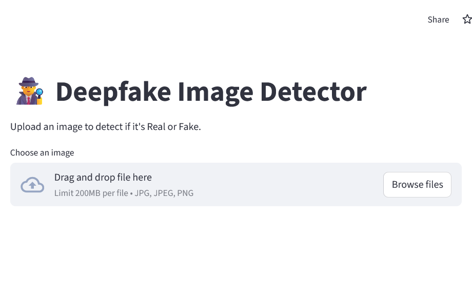

# Deepfake Image Detector

A web application for detecting deepfake images using a Convolutional Neural Network (CNN) model. Built with Streamlit, TensorFlow, and OpenCV, this app allows users to upload an image and receive a prediction on whether the image is real or fake.

## Features

- **User-friendly UI**: Simple drag-and-drop interface for image upload.
- **Automated Model Download**: Downloads the pre-trained CNN model from Hugging Face if not present locally.
- **Image Preprocessing**: Handles resizing, normalization, and color conversion for robust predictions.
- **Real/Fake Prediction**: Uses a deep learning model to classify images and displays confidence scores.

## Demo



## Getting Started

### Prerequisites

- Python 3.7+
- pip

### Installation

1. **Clone the repository**
   ```bash
   git clone https://github.com/EtimbukUdofia/Deepfake-Image-Detector-Streamlit.git
   cd Deepfake-Image-Detector-Streamlit
   ```
2. **Install dependencies**
   ```bash
   pip install -r requirements.txt
   ```

### Running the App

```bash
streamlit run streamlit_app.py
```

The app will open in your default web browser. If not, visit [http://localhost:8501](http://localhost:8501).

## How It Works

1. **Model Loading**: On first run, the app downloads the CNN model (`cnn_model.h5`) from Hugging Face if not already present.
2. **Image Upload**: Users upload a `.jpg`, `.jpeg`, or `.png` image.
3. **Preprocessing**: The image is resized to 224x224, converted to RGB, and normalized.
4. **Prediction**: The model predicts the probability of the image being fake. If the probability is ≥ 0.5, the image is labeled as "Fake"; otherwise, "Real".
5. **Results**: The app displays the prediction and confidence score.

## File Structure

```
├── requirements.txt         # Python dependencies
├── streamlit_app.py         # Main Streamlit application
```

## Model Details

- **Model File**: `cnn_model.h5`
- **Source**: [Hugging Face Model Repo](https://huggingface.co/VictoryUdofia/deepfake-model-h5)
- **Input Size**: 224x224 RGB images
- **Output**: Single probability value (0 = Real, 1 = Fake)

## Dependencies

- [Streamlit](https://streamlit.io/)
- [TensorFlow](https://www.tensorflow.org/)
- [OpenCV-Python](https://opencv.org/)
- [NumPy](https://numpy.org/)
- [Hugging Face Hub](https://huggingface.co/docs/hub/index)

## Notes

- The model is automatically downloaded if not present in the project directory.
- Only image files (`.jpg`, `.jpeg`, `.png`) are supported.
- For best results, use clear, high-quality images.

## License

This project is licensed under the MIT License.

## Acknowledgements

- [Victory Udofia](https://huggingface.co/VictoryUdofia) for the pre-trained model.
- [Hugging Face](https://huggingface.co/) for model hosting.

## Contact

For questions or feedback, please open an issue or contact the repository owner.
